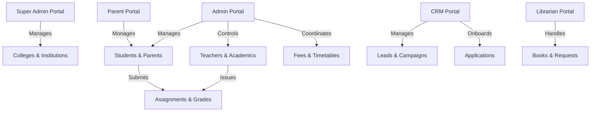

# Enterprise College ERP & CRM Platform

[](https://nodejs.org/)
[](https://react.dev/)
[](https://expressjs.com/)
[](https://www.mongodb.com/)
[](https://opensource.org/licenses/ISC)

A highly scalable, multi-role Enterprise Resource Planning (ERP) and Customer Relationship Management (CRM) system designed to automate college admissions, manage student-teacher portals, simplify fee collections, and digitize administrative workflows.

---

## 🌟 Key System Architecture & Core Modules

The application is structured into **6 specialized portals** connected to a centralized administrative back-office:



### 1. Customer Relationship Management (CRM)
* **Lead Tracking Pipeline**: Capture, assign, and transition leads through custom marketing stages (New Inquiry, Contacted, Application Submitted, Admitted).
* **Automated Task Scheduler**: Schedule automated follow-ups and marketing campaigns.
* **Onboarding & Auto-Enrollment**: An admissions engine that converts approved applications into Student accounts in one click, handles parent linkage, and triggers auto-assignment of fees/course material.

### 2. Multi-Portal Academic ERP
* **Super Admin**: Infrastructure control, college additions, central settings management, and activity logging.
* **Admin**: Role & permission management, timetable generation, teacher assignment, teacher attendance tracking, fee invoice generation, and report aggregation.
* **Teacher**: Record student attendance, create/grade assignments, input exam results, and manage class timetables.
* **Student**: View/submit assignments, track attendance metrics, view academic results, search library catalogs, and check outstanding fees.
* **Parent**: Unified view of the child's academic performance, timetable, attendance logs, and direct invoice tracking.
* **Librarian**: Track book inventory, manage checkouts, and approve/deny book requests.

---

## 🛠 Tech Stack

### Frontend (React Client)
* **Core Framework**: React 19 (Vite-powered for fast HMR)
* **State Management & Caching**: TanStack React Query (v5) for high-performance server state sync
* **Routing**: React Router DOM (v7)
* **Data Visualization**: Recharts (dynamic admission & fee reports)
* **Animations**: AOS (Animate on Scroll)
* **Notifications**: React Toastify & React Hot Toast
* **HTTP Client**: Axios

### Backend (REST API Server)
* **Runtime & Framework**: Node.js, Express.js (v5)
* **Database**: MongoDB with Mongoose ODM (v9)
* **Media & Cloud Storage**: AWS S3 SDK (v3) with Multer & Multer-S3
* **Communication APIs**: Brevo (Sendinblue), SendGrid, Resend, and Nodemailer SMTP engine
* **Security & Middleware**:
  * **JWT**: Secure session-based tokens
  * **Bcrypt.js**: Cryptographic password hashing
  * **Helmet**: Secure HTTP response headers
  * **Express Rate Limit**: Anti-brute force and DDoS mitigation
  * **Express Mongo Sanitize**: Defense against NoSQL injections
  * **XSS-Clean**: User input sanitization
  * **Express Validator**: Declaring clear request body schemas

---

## 📂 Project Directory Structure

```text
├── backend/
│   ├── config/              # DB connection & environmental configurations
│   ├── middleware/          # JWT protection, RBAC guards, & upload handlers
│   ├── models/              # Mongoose DB Schemas (User, Student, Lead, Application, Fee...)
│   ├── routes/              # Express API Routes (auth, admin, superadmin, leads, library...)
│   ├── uploads/             # Local backup file storage
│   ├── utils/               # Helper scripts (notification triggers, formatters)
│   ├── server.js            # Node API Server entrypoint
│   └── package.json
│
├── react-version/
│   ├── src/
│   │   ├── assets/          # Static media assets & global styles
│   │   ├── components/      # Guard components (ProtectedRoute, PermissionGuard)
│   │   ├── layouts/         # Layout modules (Sidebar, Topbar, Dash layouts)
│   │   ├── pages/           # Portal-specific page modules (80+ unique views)
│   │   ├── services/        # Axios API configurations & request wrappers
│   │   ├── App.jsx          # Route declarations and portal layouts
│   │   └── main.jsx         # App bootstrapping
│   ├── vite.config.js       # Vite bundler configurations
│   └── package.json
└── README.md
```

---

## ⚙️ Installation & Setup

### Prerequisites
* **Node.js** (v18.x or higher)
* **MongoDB** (Local instance or Atlas cloud cluster)
* **AWS S3 Bucket** (for profile picture & document uploads)

### 1. Backend Configuration
Navigate to the `backend/` directory, install packages, and configure variables:

```bash
cd backend
npm install
```

Create a `.env` file in the `backend/` folder:
```env
PORT=5000
MONGO_URI=your_mongodb_connection_string
JWT_SECRET=your_jwt_signature_secret

# AWS S3 Storage Details
AWS_ACCESS_KEY_ID=your_aws_access_key
AWS_SECRET_ACCESS_KEY=your_aws_secret_key
AWS_REGION=your_aws_region
AWS_BUCKET_NAME=your_aws_s3_bucket_name

# Email Notifications (Resend / SendGrid / Brevo)
SENDGRID_API_KEY=your_sendgrid_key
BREVO_API_KEY=your_brevo_key
RESEND_API_KEY=your_resend_key
EMAIL_FROM=noreply@yourdomain.com
```

### 2. Seeding Core Permissions & System Data
Run database seed scripts to configure initial system permissions, default roles, and program schemas:

```bash
# Seed standard system roles and access keys
node seed_roles.js

# Seed academic programs & classes
node seedPrograms.js

# Seed profile image placeholders
node seed_avatars.js
```

### 3. Running the Servers

**Start Backend API Server (Development Mode):**
```bash
cd backend
npm run dev
```

**Start Frontend Application (Vite Server):**
```bash
cd react-version
npm install
npm run dev
```

---

## 🛡️ Security Implementations

* **NoSQL Injection Defense**: User queries pass through `express-mongo-sanitize` to strip prohibited MongoDB operators.
* **XSS Sanitization**: Input fields are parsed through `xss-clean` to filter out malicious HTML or scripting code blocks.
* **API Rate Limiting**: Implements basic endpoint rate limiting via `express-rate-limit` to prevent brute-force attacks.
* **HTTP Header Shield**: Integrated `helmet` to automate security configurations for Response headers.

---

## 📧 Automated Notification Dispatch Flow

The system implements multiple integration routes to ensure notifications reach students and parents instantly:

```text
               ┌──► NodeMailer (SMTP Backup)
               ├──► SendGrid (Corporate Alerts)
Outbound SMS  ─┼──► Brevo API (Enrollment Confirmations)
 & Email Queue └──► Resend API (Invoice Dispatches)
```
Whenever an assignment is graded, a fee invoice generated, or a student enrollment finalized, triggers execute background email notifications through the configured API services.

---

## 📝 License
Distributed under the ISC License. See `LICENSE` in the root (if provided) for more details.
